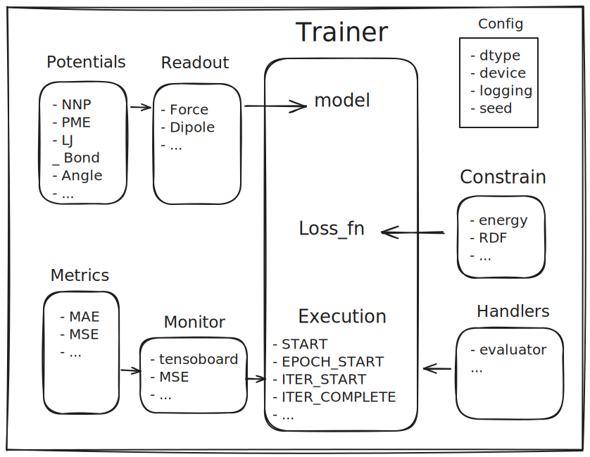

# MolPot: An Extensible Framework for Molecular Potential Training & Deployment

`molpot` is designed for efficient building, training and deployment of molecular simulation potentials, leveraging a modular design to enable flexible customization and seamless integration into different workflows. It incorporates cutting-edge techniques, such as `torch.compile` for optimized deep learning execution and high-performance C++ operators for computational efficiency. For more information, please refer to the [documentation](https://molpot.readthedocs.io/en/latest/).



## Feature

* Hybrid and Modular Neural Network and Classical Potential;
* High-Performance C++ Operators;
* Built-in torch-based MD simulation;
* Versatile Data Pipeline;
* User-Friendly App Wrapping

## Installation

To install `molpot`, you can use pip:

```bash
pip install molpot
```
or clone the repository and install it manually:

```bash
git clone http:
cd molpot
pip install .
```

or install from docker

```bash
docker pull molpot/molpot:latest
```

or apptainer by using definition file

```bash
apptainer build molpot.sif molpot.def
```

## How to get started

Instead of giving getting started guide here, we prefer to give a tutorial about how to learn this package, since `molpot` is a general and extensible package. Once you have a requirements, find a similar example or tutorial, read the code and check the docstring, and you will get a good understanding. Here is a table of content of the doc:

* [tutorial](): A how-to notebook driven by tasks
* [examples](): A collection of examples
* [getting started](): Introduce the basic concepts
* [API](): A complete API reference
* [contributing](): how to customize your own module

## Interface

TO BE ANNOUNCED

## Roadmap

* [x] Physical-based potential support
* [ ] Active learning

## Citation

## Acknowledgements