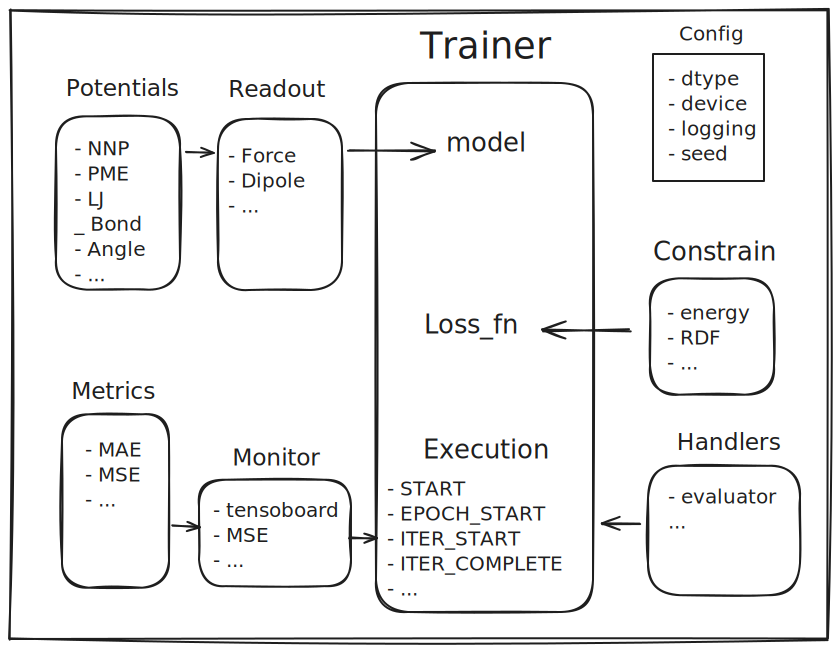

# MolPot: An Extensible Framework for Molecular Potential Training & Deployment

`molpot` is designed for efficient building, training and deployment of molecular simulation potentials, leveraging a modular design to enable flexible customization and seamless integration into different workflows. It incorporates cutting-edge techniques, such as `torch.compile` for optimized deep learning execution and high-performance C++ operators for computational efficiency. For more information, please refer to the [documentation](https://molpot.readthedocs.io/en/latest/).

## Feature

* Hybrid and Modular Neural Network and Classical Potential;
* High-Performance C++ Operators;
* Built-in torch-based MD simulation;
* Versatile Data Pipeline;
* User-Friendly App Wrapping
